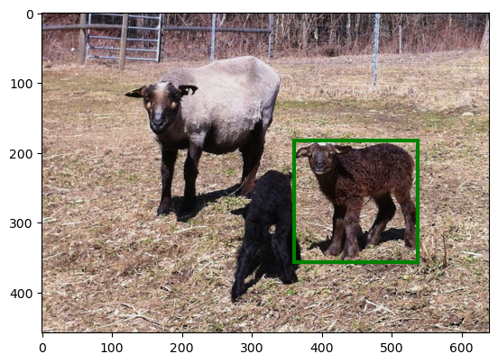

# Grounded Semantics: Referring Expression Comprehension

A machine learning project that identifies objects in images based on natural language descriptions (e.g., "the lady with the blue shirt").

## Overview

This project implements a "Words as Classifiers" approach to solve referring expression comprehension. Given an image and a text description, the model identifies which object in the image the description refers to.

### Example



**Reference ID:** 35254 (Annotation ID: 275551)

**Referring Expressions:**
1. "white brown sheep right"
2. "black sheep on right"
3. "sheep on the right"

All three expressions refer to the same object (highlighted with green bounding box).

## Task Description

**Referring Expression Comprehension** is the task of:
1. Taking an image containing multiple objects
2. Receiving a natural language referring expression
3. Identifying the correct object that matches the expression

## Approach

1. **Feature Extraction:** Visual features (VGG19 or CLIP) + positional features (bounding box, area, etc.)
2. **Training:** Train one binary classifier per word using positive/negative examples
3. **Inference:** Multiply word probabilities and select object with highest score

## Installation

### Prerequisites
- Python 3.7+
- CUDA-capable GPU (recommended)

### Dependencies

```bash
pip install numpy tensorflow scikit-learn scikit-image pillow matplotlib tqdm
# OR for CLIP version:
pip install torch torchvision openai-clip scikit-learn scikit-image pillow tqdm
```

### Dataset

Download RefCOCO dataset (~12GB):

```bash
bash download_coco.sh
```

Or manually download from:
- MSCOCO images: http://images.cocodataset.org/zips/
- RefCOCO annotations: http://bvisionweb1.cs.unc.edu/licheng/referit/data/refcoco.zip

Organize as: `coco/images/mscoco/images/` and `coco/refcoco/`

## Usage

**VGG19 version:**
```bash
python grounded_semantics.py
```

**CLIP version:**
```bash
python grounded_semantics_clip.py
```

The scripts will train word classifiers and automatically evaluate on validation and test sets.

## Training Process

1. **Feature Extraction:**
   - For each training reference, extract visual features (CNN) and positional features
   - Combine into a single feature vector

2. **Collect Positive Examples:**
   - For each word in each sentence, add the object's feature vector as a positive example
   - Example: Object described as "blue shirt" → adds features to both "blue" and "shirt" classifiers

3. **Generate Negative Examples:**
   - For each word, sample objects from other words as negatives
   - Ratio: 3 negative examples per positive example

4. **Train Classifiers:**
   - Train one Logistic Regression classifier per word
   - Each classifier learns to distinguish positive from negative examples

## Inference Process

1. Extract features for all objects in the image
2. For each referring expression:
   - Compute probability for each word: `P(word | object)`
   - Multiply probabilities: `P(blue) × P(shirt) × P(lady)`
   - Select object with highest combined probability

## Project Structure

```
grounded-semantics/
├── refer.py                    # REFER API for dataset access
├── grounded_semantics.py       # VGG19 implementation
├── grounded_semantics_clip.py  # CLIP implementation
└── download_coco.sh            # Dataset download script
```

## Technologies

- **Feature Extraction:** VGG19 (TensorFlow) or CLIP (PyTorch)
- **Classifiers:** Logistic Regression (scikit-learn)
- **Datasets:** MSCOCO + RefCOCO

## Acknowledgments

- REFER Dataset: https://github.com/lichengunc/refer
- MSCOCO Dataset: https://cocodataset.org/
